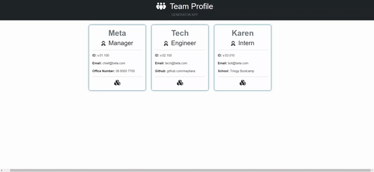
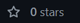

# Team Profile HTML generator


## Description
As part of module 10 assignment, Using the user-story **A manager want to generate a webpage that displays team profile with basic info**.
In this module we have to build a small application that generates HTML file that displays the firstName, Role, ID#, Email and per role there will have a specific question asking the Office Number(for Manager),github(for Engineer) and School(for Intern), and also, if the user wants to register more employee.

## Application
- npm packages (inquirer@8 and -D jest)
- Node.js for the powershell environment
- jest.js for unit testing
- git bash to push the files to the new Repo here in github

## Table of Contents
1. [Installation](#installation)
2. [Usage](#usage)
3. [Demo](#demo)
3. [Github Link](#github-link)
4. [Feedback or Contribute](#feedback-or-contribute)
5. [License](#license)
6. [Reference](#reference)

## Installation
* Clone the ***Team Profile Generator App***, to your local machine
* enter ***$ npm i***
* run ***node app.js***
* for testing, ***npm run test***

## Usage

```
/
└── __tests__                    //unit testing
    ├── Employee.test.js
    └── Manager.test.js
    ├── Engineer.test.js
    └── Intern.test.js
└── dist                        //generated output file
    ├── team-profile.html
└── src
    ├── assets                  //images and etc.
    ├── employees               //classes that required to export the module     
        ├── Employee.js
        └── Manager.js
        ├── Engineer.js
        └── Intern.js
├── generate-html           //classes that required to export the module     
    ├── html.js
    └── demo-templates      //placeholder template for generated data
        ├── index.html
        └── card-container.html
└── package-lock.json
└── package.json
└── app.js                      //main script for the app
└── README.md
```

## Demo
* Check out the link for testing and running the application, [**Demo video**](https://vimeo.com/734123626)



## Github Link
You might be a shooting star &#9733; Don't forget to click the  button on any of my repositories [github/maytiara](https://github.com/maytiara)

## Feedback or Contribute
***If you have any feedback or suggestion feel free to send an email,*** codingowl898@gmail.com
***Or else, if you would like to make a contribution, feel free to***  

## License
All rights reserved. Under the MIT license.

## Reference
[Buy me a coffee icon](https://www.buymeacoffee.com/downloads), [License Badge](https://shields.io/), [Xbox Game Bar](https://apps.microsoft.com/store/detail/xbox-game-bar/9NZKPSTSNW4P?hl=en-au&gl=AU) 'an app to record the demo video' and instructors ***Sam*** guided syntax code.

